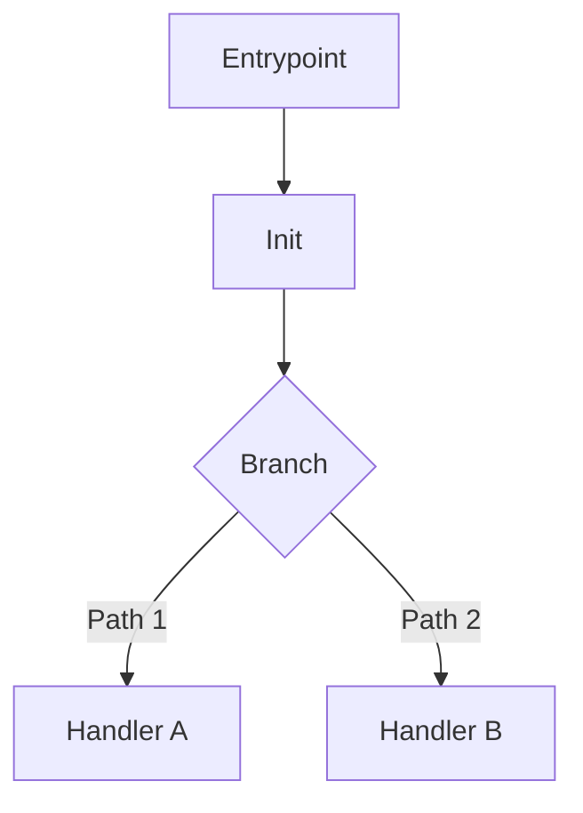

Use this format whenever you produce review or flow-analysis output.

## File References

* Use markdown links for every concrete file mention.
* Include line anchors when citing specific logic.
* Preferred style:
  * File only: `[cmd/root.go](cmd/root.go)`
  * File with line: `[cmd/root.go#L12](cmd/root.go#L12)`
* Do not cite line numbers without links.
* Keep references precise and tied to specific claims.

## Flow Diagrams

* Provide a Mermaid diagram when describing non-trivial flows.
* Keep diagrams directional, readable, and close to the narrative.
* Use short node labels and include key branch points.

Template:

## Review Structure

* Findings first for review tasks, ordered by severity.
* Follow with open questions/assumptions.
* End with concise summary or next checks.

## Evidence Quality

* Ground claims in observed code only.
* Mark uncertainty explicitly when behavior is inferred.
* Distinguish confirmed behavior from assumptions.
