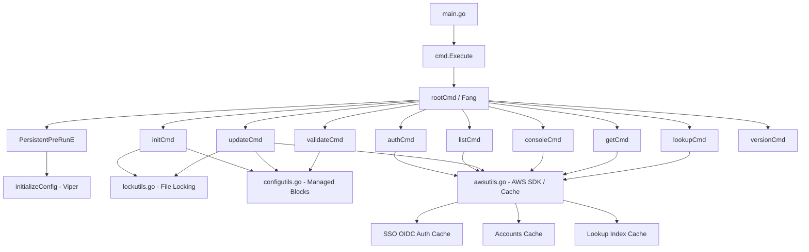

# Design Document: AWS SSO Manager

## Overview

AWS SSO Manager is an existing Go CLI tool that automates the management of AWS Identity Center (SSO) profiles in `~/.aws/config`. It provides commands for initializing SSO sessions, authenticating via the OAuth 2.0 device authorization flow, listing accounts/roles, synchronizing local AWS CLI profiles, generating console URLs, and validating configuration integrity.

This design documents the existing architecture of the tool and captures intentional behavior changes specified in the requirements (Req 3.18 `--no-cache` ordering, Req 11.1 lock file path, Req 12.4 env prefix, Req 12.5 verbose debug level).

The tool is built with:

* Go 1.26, Cobra/Fang for CLI framework, Viper for configuration
* AWS SDK v2 (`sso`, `ssooidc`) for API interactions
* Charmbracelet libraries (`huh`, `lipgloss`, `log`, `spinner`) for TUI
* `northwood-labs/aws-config-parser` for INI file manipulation

## Architecture



The architecture follows a flat command-based structure within a single `cmd` package:

* `main.go` → `cmd.Execute()` bootstraps the CLI via Cobra/Fang with signal handling.
* `cmd/root.go` defines the root command, global flags (`--config`, `--cache-duration`, `--verbose`), Viper configuration initialization, and the shared logger.
* Each command file (`init.go`, `auth.go`, `list.go`, `update.go`, `console.go`, `get.go`, `lookup.go`, `validate.go`, `version.go`) registers a subcommand on `rootCmd`.
* Shared utilities are in `awsutils.go` (AWS SDK interactions, caching, SSO session management), `configutils.go` (managed block parsing, profile name generation, INI manipulation), and `lockutils.go` (flock-based file locking).

### Key Design Decisions

1. **Single package (`cmd`)**: All command and utility code lives in one package, using package-level variables for shared state (logger, config, paths). This simplifies internal access at the cost of encapsulation.
2. **Managed blocks with comment markers**: The tool owns specific regions of `~/.aws/config` delimited by `; -------- aws-sso-manager: start/end <profile> --------` comments, allowing coexistence with manually-managed sections.
3. **Atomic file writes**: All modifications to `~/.aws/config` and cache files use a write-to-temp-then-rename pattern to prevent corruption on interrupted writes.
4. **Advisory file locking**: `flock`-based locking prevents concurrent tool invocations from corrupting the shared config file.
5. **Multi-layer caching**: SSO auth tokens use the standard AWS SDK cache location; account/role data uses a separate JSON cache with SHA-256 hashed filenames; a lookup index cache provides fast O(1) lookups by account ID, name, or profile name.

## Components and Interfaces

### CLI Entry Point

* **`main.go`**: Calls `cmd.Execute()`.
* **`cmd.Execute()`**: Wraps `fang.Execute(ctx, rootCmd, fang.WithNotifySignal(...))` for graceful signal handling. Exits with code 1 on error.

### Root Command (`cmd/root.go`)

* **Global flags**: `--config` (TOML path), `--cache-duration` (Go duration + `d` suffix), `--verbose` (stackable count).
* **`PersistentPreRunE`**: Sets log level based on `-v` count (0=warn, 1=info, 2+=debug), parses cache duration, calls `initializeConfig`.
* **`initializeConfig(cmd)`**: Configures Viper with env prefix `ASV_` (changing to `ASM_` per Req 12.4), reads TOML config, binds command flags. Creates default config directory/file if missing.
* **`parseCacheDurationFlag(raw)`**: Parses duration strings, converting `Nd` day tokens to hours. Returns error for empty, zero, or negative values.

### Init Command (`cmd/init.go`)

* **Profile resolution**: Arg → config default → TUI prompt.
* **URL normalization** (`normalizeSSOStartURL`): Handles bare subdomain, dot-containing, slash-containing, and full URL inputs.
* **Guard checks**: Rejects if `[sso-session <profile>]` already exists or if orphaned managed block markers are present.
* **Write flow**: Acquire lock → read existing config → write to temp file (existing content + managed block) → `os.Rename` → release lock.

### Auth Command (`cmd/auth.go`)

* **Profile resolution**: Arg → config default → TUI prompt.
* **Aliases**: `login`.
* **`ensureAuthenticatedSSOSession`**: Checks cache validity first; if expired/missing, runs full auth flow.
* **`authenticateAndCacheSSOSession`**: Registers OIDC client → starts device authorization → opens browser (or prints URL) → polls `CreateToken` every 2s for up to 60s → saves cache.
* **`getOrRefreshAuthenticatedCache`**: Used by other commands to transparently ensure valid auth before proceeding.
* **`--browser` flag** (default: true): Controls whether to auto-open the verification URL.

### List Command (`cmd/list.go`)

* **Profile resolution**: Arg → config default → TUI prompt.
* **Aliases**: `ls`.
* **Output format enforcement**: Exactly one of `--json`, `--csv`, `--markdown`, or default TUI table.
* **Filtering**: `--accounts` and `--roles` flags for case-insensitive substring filtering.
* **`--no-cache`**: Per Req 3.18, fetches fresh data first, then deletes old cache (behavior change from current code which deletes first).
* **Rendering**: TUI table via `lipgloss/table` with rounded borders; CSV with quoted fields; GFM markdown table.
* **Data flow**: Auth → spinner → `listAWSAccounts` (cache-aware) → format → output.

### Update Command (`cmd/update.go`)

* **Profile resolution**: Arg → config default → TUI prompt.
* **Aliases**: `upgrade`, `sync`.
* **Flow**: Acquire lock → extract managed section → load INI → auth → fetch accounts/roles → `buildUpdatedManagedSections` (rebuild from scratch) → write temp → `setManagedSection` → chmod 0644 → rename → release lock.
* **`buildUpdatedManagedSections`**: Creates fresh `Sections`, preserves the `[sso-session]` header, generates `[profile <name>]` entries with `sso_session`, `sso_account_id`, `sso_role_name`, `region`, `output` keys.

### Console Command (`cmd/console.go`)

* **Argument parsing**: 2 args = profile + URL; 1 arg with `://` = URL; 1 arg without = profile; 0 args = config default.
* **Clipboard integration**: Reads console URL from clipboard if `--clipboard` is true and content matches `console.aws.amazon.com`.
* **Interactive prompts**: TUI select forms for profile, account, and role when not provided.
* **URL generation**: Strips account subdomain from console URL, encodes destination, builds `https://<start-host>/start/#/console?account_id=<id>&role_name=<role>&destination=<encoded>`.

### Get Command (`cmd/get.go`)

* **Subcommands**: `get accounts` (line-delimited account IDs), `get roles --for <account-id>` (line-delimited role names).
* **Validation**: `--for` must be a 12-digit numeric string.
* **Data source**: Reads from lookup index cache, building it from accounts cache if missing.

### Lookup Command (`cmd/lookup.go`)

* **Subcommands**: `lookup account <identifier>`, `lookup role <substring> --for <identifier>`.
* **Account resolution** (`resolveLookupAccount`): Matches by account ID, profile name (CI), or account name (CI). Returns error on ambiguous or missing matches.
* **Role search**: Case-insensitive substring match within resolved account's roles.
* **Output**: Plain text (account ID or role names) or JSON with `--json`.

### Validate Command (`cmd/validate.go`)

* **Aliases**: `check`, `lint`.
* **Checks**: Marker pairing (start/end counts), duplicates, overlaps, orphaned markers (markers without `[sso-session]`), unmanaged sections (`[sso-session]` without markers).
* **Output**: `OK`/`FAIL` per profile, summary count, exit code 0 or 1.

### Config Utilities (`cmd/configutils.go`)

* **Managed block parsing** (`inspectManagedMarkers`): Line-by-line scanner tracking active profile state, detecting overlaps, mismatches, duplicates.
* **Profile name generation** (`getProfileName`): Reads pattern order, delimiter, prefix, suffix, and substr_match_replace maps from Viper config. Falls back to `buildDefaultProfileName` (lowercased, non-alphanumeric → hyphens).
* **Section extraction/replacement** (`getManagedSection`, `setManagedSection`): Reads/writes managed block content between markers.

### Lock Utilities (`cmd/lockutils.go`)

* **`acquireAWSConfigLock`**: Opens lock file, retries `flock(LOCK_EX|LOCK_NB)` every 100ms with 5s timeout, writes PID on success.
* **Lock file path**: Currently `~/.aws/.aws-sso-manager.config.lock`, changing to `~/.config/.aws-sso-manager/.config.lock` per Req 11.1.
* **`Release()`**: Unlocks and closes the file descriptor.

### AWS Utilities (`cmd/awsutils.go`)

* **SSO session management**: `getSsoSession` reads `[sso-session <profile>]` from AWS config. `getSDKConfig` creates an AWS SDK config for the session's region.
* **Auth cache**: Uses `ssocreds.StandardCachedTokenFilepath` for cache location. `cacheFileData.read/save` for JSON serialization with expiry checking.
* **Accounts cache**: SHA-256 hashed filenames under `~/.config/aws-sso-manager/cache/`. `readListAWSAccountsCache`/`writeListAWSAccountsCache` with TTL-based expiry and atomic writes (`.tmp` → rename).
* **Lookup index**: `buildListAWSAccountsLookupIndex` creates maps for O(1) lookup by account ID, name (CI), and profile name (CI). Written alongside accounts cache when no filters are active.
* **API fetching** (`fetchListAWSAccountsFromSSO`): Paginates `ListAccounts` and `ListAccountRoles`, applies filters, sorts results, generates profile names.

## Data Models

### Configuration (`~/.config/aws-sso-manager/config.toml`)

```toml
profile-name = "abc"

[abc.rename]
pattern.order     = ["PREFIX", "ACCOUNT", "ROLE", "SUFFIX"]
pattern.delimiter = "-"
prefix = ""
suffix = ""

  [abc.rename.accounts.substr_match_replace]
  "Production" = "prod"

  [abc.rename.roles.substr_match_replace]
  "AdministratorAccess" = "admin"
```

### SSO Auth Cache (`cacheFileData`)

```go
type cacheFileData struct {
    ExpiresAt             time.Time `json:"expiresAt"`
    RegistrationExpiresAt time.Time `json:"registrationExpiresAt"`
    StartUrl              string    `json:"startUrl"`
    Region                string    `json:"region"`
    AccessToken           string    `json:"accessToken"`
    ClientId              string    `json:"clientId"`
    ClientSecret          string    `json:"clientSecret"`
}
```

Location: Standard AWS SDK SSO cache path (via `ssocreds.StandardCachedTokenFilepath`).

### Accounts Cache (`listAWSAccountsCacheData`)

```go
type listAWSAccountsCacheData struct {
    CachedAt  time.Time    `json:"cached_at"`
    ExpiresAt time.Time    `json:"expires_at"`
    Accounts  listAccounts `json:"accounts"`
}

type listAccounts struct {
    Accounts []listAccount `json:"accounts"`
}

type listAccount struct {
    ID    string     `json:"id"`
    Name  string     `json:"name"`
    Email string     `json:"email"`
    Roles []listRole `json:"roles"`
}

type listRole struct {
    AccountID string `json:"account_id"`
    Name      string `json:"name"`
    Profile   string `json:"profile"`
}
```

Location: `~/.config/aws-sso-manager/cache/accounts-<sha256>.json`. Filename derived from SHA-256 of `listAWSAccounts.v1\x00<profile>\x00<accountFilter>\x00<roleFilter>`.

### Lookup Index Cache (`listAWSAccountsLookupCacheData`)

```go
type listAWSAccountsLookupCacheData struct {
    CachedAt  time.Time                  `json:"cached_at"`
    ExpiresAt time.Time                  `json:"expires_at"`
    Index     listAWSAccountsLookupIndex `json:"index"`
}

type listAWSAccountsLookupIndex struct {
    ProfileName           string                                  `json:"profile_name"`
    AccountsByID          map[string]listAWSAccountsLookupAccount `json:"accounts_by_id"`
    AccountIDsByNameCI    map[string][]string                     `json:"account_ids_by_name_ci"`
    AccountIDsByProfileCI map[string][]string                     `json:"account_ids_by_profile_ci"`
}

type listAWSAccountsLookupAccount struct {
    Name     string   `json:"name"`
    Profiles []string `json:"profiles"`
    Roles    []string `json:"roles"`
}
```

Location: Same directory as accounts cache, with `-lookup.json` suffix.

### Managed Block Format (in `~/.aws/config`)

```ini
; -------- aws-sso-manager: start myprofile --------
[sso-session myprofile]
sso_start_url = https://example.awsapps.com/start
sso_region = us-east-1
sso_registration_scopes = sso:account:access

[profile example-admin]
sso_session = myprofile
sso_account_id = 123456789012
sso_role_name = AdministratorAccess
region = us-east-1
output = json
; -------- aws-sso-manager: end myprofile --------
```

### SSO Profile (internal)

```go
type ssoProfile struct {
    Name     string
    StartURL string
    Region   string
    Scopes   string
}
```

## Correctness Properties

_A property is a characteristic or behavior that should hold true across all valid executions of a system — essentially, a formal statement about what the system should do. Properties serve as the bridge between human-readable specifications and machine-verifiable correctness guarantees._

### Property 1: SSO Start URL Normalization Round Trip

_For any_ valid SSO start URL input string (bare subdomain, dot-containing without scheme, slash-containing without scheme, or full URL), `normalizeSSOStartURL` should produce a string that starts with `https://` and, for bare subdomains, ends with `.awsapps.com/start`. The output should always be a parseable URL.

**Validates: Requirements 1.5, 1.6, 1.7**

### Property 2: Account and Role Sorting

_For any_ list of accounts with roles returned by `fetchListAWSAccountsFromSSO` (or sorted by the same logic), the accounts should be sorted alphabetically by name (case-insensitive), and within each account, the roles should be sorted alphabetically by name (case-insensitive).

**Validates: Requirements 3.7**

### Property 3: Output Formats Contain All Data

_For any_ non-empty `listAccounts` and profile name, the CSV output from `renderCSVTable` should contain every account ID, account name, role name, and generated profile name present in the input data. Similarly, the markdown output from `renderMarkdownTable` should contain the same data. The JSON output from `json.Marshal` should round-trip back to an equivalent `listAccounts` struct.

**Validates: Requirements 3.9, 3.10, 3.11**

### Property 4: Account and Role Filtering

_For any_ list of accounts and a non-empty filter substring, filtering accounts by name (case-insensitive substring match) should return only accounts whose name contains the substring (case-insensitive), and filtering roles by name should return only roles whose name contains the substring (case-insensitive). The filtered result should be a subset of the original.

**Validates: Requirements 3.13, 3.14**

### Property 5: Lookup Index Round Trip

_For any_ `listAccounts` and profile name, building a `listAWSAccountsLookupIndex` and then looking up each account by its ID should return the correct account name, roles, and profiles. Looking up by account name (lowercased) should return the correct account IDs. Looking up by profile name (lowercased) should return the correct account IDs.

**Validates: Requirements 3.19, 7.1, 10.11**

### Property 6: Managed Block Marker Validation

_For any_ AWS config file content containing managed block markers, `inspectManagedMarkers` should detect: (a) mismatched start/end counts for any profile, (b) duplicate blocks for the same profile, (c) overlapping blocks where one profile's start appears inside another's block, (d) unmatched end markers, and (e) unclosed start markers. For well-formed configs (exactly one start and one matching end per profile, no overlaps), the issues map should be empty.

**Validates: Requirements 8.3, 8.4, 8.5, 8.6, 8.7**

### Property 7: Profile Name Generation with Pattern

_For any_ valid pattern configuration (non-empty order list of tokens from {PREFIX, ACCOUNT, ROLE, SUFFIX}, a non-empty delimiter, and non-empty prefix/suffix values), `getProfileName` should produce a string that contains the expected tokens joined by the delimiter. Empty prefix/suffix values should be omitted from the output. The output should be lowercased.

**Validates: Requirements 9.1, 9.2, 9.3, 9.4, 9.5, 9.12**

### Property 8: Substring Match Replacement in Profile Names

_For any_ account name and a `substr_match_replace` map where a key is a case-insensitive substring of the account name, `getProfileName` should replace the account token with the corresponding replacement value. The same rule applies to role names with the roles `substr_match_replace` map.

**Validates: Requirements 9.6, 9.8**

### Property 9: Default Profile Name Generation

_For any_ account name and role name, when no pattern order is configured, `buildDefaultProfileName` should produce a lowercased string where non-alphanumeric characters are replaced with hyphens, in the format `<account-token>-<role-token>`. The `toProfileToken` function should be idempotent: `toProfileToken(toProfileToken(x)) == toProfileToken(x)`.

**Validates: Requirements 9.10**

### Property 10: Cache File Path Determinism

_For any_ profile name and filter combination, `listAWSAccountsInput.cacheFilePath()` should produce a deterministic path based on the SHA-256 hash. The same inputs should always produce the same path, and different inputs should produce different paths (with high probability).

**Validates: Requirements 10.2**

### Property 11: Cache Expiry Detection

_For any_ cache entry with a `cached_at` timestamp and a positive cache duration, `readListAWSAccountsCache` should return the cached data when `time.Now()` is before `cached_at + duration`, and should return not-found (triggering deletion) when `time.Now()` is after `cached_at + duration`.

**Validates: Requirements 10.4**

### Property 12: Cache Duration Parsing

_For any_ valid Go duration string (optionally containing `Nd` day tokens), `parseCacheDurationFlag` should return a positive duration. Day tokens should be converted to hours (1d = 24h). Empty strings, zero, and negative durations should return errors.

**Validates: Requirements 10.6, 10.8**

### Property 13: Console URL Account Subdomain Stripping

_For any_ AWS Console URL of the form `https://<account-subdomain>.<service>.console.aws.amazon.com/...`, `stripAccountFromURL` should remove the account subdomain, producing `https://<service>.console.aws.amazon.com/...`. URLs without an account subdomain should pass through unchanged.

**Validates: Requirements 5.9**

### Property 14: Account ID Validation

_For any_ string that is not exactly 12 digits, `getRoleNamesForAccountID` should return an error. _For any_ 12-digit numeric string that exists in the lookup index, it should return the roles for that account.

**Validates: Requirements 6.3**

### Property 15: Lookup Account Resolution Correctness

_For any_ lookup index and identifier, `resolveLookupAccount` should: return exactly one account when the identifier uniquely matches by ID, profile name (CI), or account name (CI); return an ambiguity error when multiple accounts match; return a not-found error when no accounts match.

**Validates: Requirements 7.4, 7.5**

### Property 16: Lookup Role Substring Search

_For any_ account with roles and a non-empty search substring, the role lookup should return only roles whose name contains the substring (case-insensitive), sorted alphabetically (case-insensitive). The result should be a subset of the account's roles.

**Validates: Requirements 7.6, 7.7**

### Property 17: Update Managed Section Generation

_For any_ list of accounts with roles and a valid SSO session section, `buildUpdatedManagedSections` should produce sections where each account-role combination has a `[profile <name>]` section containing exactly the keys `sso_session`, `sso_account_id`, `sso_role_name`, `region`, and `output`. The count returned should equal the total number of account-role combinations.

**Validates: Requirements 4.9**

## Error Handling

### Command-Level Errors

All commands use `RunE` (returning errors) rather than `Run` (panicking). Errors propagate up through Cobra to the root command, which exits with code 1 via `fang.Execute`.

### AWS API Errors

* **Authentication errors**: The `waitForCustomerToAuthenticate` function handles all OIDC error types (`AccessDeniedException`, `ExpiredTokenException`, `AuthorizationPendingException`, etc.) with specific error messages.
* **SDK config errors**: `getSDKConfig` wraps credential, assume-role, config-load, and missing-profile errors with descriptive messages.
* **Pagination errors**: `fetchListAWSAccountsFromSSO` wraps `ListAccounts` and `ListAccountRoles` pagination errors.

### File Operation Errors

* **Lock acquisition timeout**: Returns a timeout error after 5 seconds of retries.
* **Lock file creation**: Creates the lock directory if missing; returns error if creation fails.
* **Atomic writes**: Temp file write failures are reported; rename failures clean up the temp file.
* **Config file missing**: `loadAWSConfig` creates the file if it doesn't exist; `initializeConfig` creates the default config directory and file.

### Cache Errors

* **Read failures**: Cache read errors (missing file, corrupt JSON, expired) fall through to fresh API fetches.
* **Write failures**: Cache write errors are logged but do not fail the command (graceful degradation).
* **Expiry handling**: Expired cache files are deleted on read; the command proceeds with a fresh fetch.

### Input Validation Errors

* **Empty/invalid cache duration**: `parseCacheDurationFlag` returns descriptive errors for empty, zero, negative, or unparseable values.
* **Invalid account ID format**: `getRoleNamesForAccountID` validates the 12-digit pattern.
* **Multiple output formats**: `list` command rejects more than one format flag.
* **Missing required flags**: `get roles` and `lookup role` require `--for`; missing flags return errors.
* **Ambiguous lookups**: `resolveLookupAccount` returns an error listing all matching account IDs.

### Guard Conditions

* **Init guards**: Rejects if `[sso-session]` already exists or orphaned markers are present.
* **Update guards**: Validates managed block markers are well-formed before proceeding.
* **Validate command**: Reports all marker anomalies and exits with code 1 if any are found.

## Testing Strategy

### Testing types

* Unit testing, using the "table-driven testing" style.
* Integration testing for AWS SDK calls, using `github.com/uber-go/mock`.
* Property-based testing, using `pgregory.net/rapid`.
* Mutation testing, using `github.com/gtramontina/ooze`.
* Fuzz testing, using Go's built-in fuzzing framework.
* Benchmarking, using Go's built-in benchmarking framework.

### Unit Testing

Unit tests should cover specific examples, edge cases, and error conditions:

* **URL normalization**: Specific examples for each input type (bare subdomain, dot, slash, full URL), plus edge cases (empty string, whitespace-only).
* **Profile name generation**: Specific examples with known config patterns, edge cases (all empty tokens, missing config).
* **Cache duration parsing**: Specific examples (`24h`, `1d`, `6h30m`, `2d12h`), edge cases (empty, `0s`, `-1h`, invalid strings).
* **Managed block parsing**: Specific examples of well-formed configs, configs with each type of anomaly.
* **Account ID validation**: Specific examples of valid 12-digit IDs, invalid formats (11 digits, letters, empty).
* **CSV/Markdown rendering**: Specific examples with known input/output, edge cases (special characters in fields, empty data).
* **Console URL stripping**: Specific examples with and without account subdomains.
* **Command alias registration**: Verify `login`, `ls`, `upgrade`, `sync`, `check`, `lint` aliases are registered.
* **Lock timeout**: Verify timeout error when lock is held by another process.

### Property-Based Testing

Property-based tests verify universal properties across randomly generated inputs. The project should use a Go property-based testing library such as `pgregory.net/rapid`.

Each property test must:

* Run a minimum of 100 iterations
* Reference its design document property with a tag comment in the format: `// Feature: aws-sso-manager, Property N: <title>`
* Each correctness property must be implemented by a single property-based test

Properties to implement:

1. **URL normalization** (Property 1): Generate random subdomain strings, dot-containing strings, slash-containing strings → verify output format.
2. **Sorting** (Property 2): Generate random account/role lists → verify sort order.
3. **Output formats** (Property 3): Generate random `listAccounts` → verify data presence in CSV, Markdown, JSON.
4. **Filtering** (Property 4): Generate random accounts + filter strings → verify subset correctness.
5. **Lookup index round trip** (Property 5): Generate random accounts → build index → verify lookups.
6. **Marker validation** (Property 6): Generate random config files with markers → verify anomaly detection.
7. **Profile name generation** (Property 7): Generate random pattern configs → verify output structure.
8. **Substring replacement** (Property 8): Generate random names + match rules → verify replacement.
9. **Default profile name / toProfileToken idempotence** (Property 9): Generate random strings → verify idempotence.
10. **Cache path determinism** (Property 10): Generate random inputs → verify deterministic hashing.
11. **Cache expiry** (Property 11): Generate random timestamps + durations → verify expiry logic.
12. **Duration parsing** (Property 12): Generate random valid duration strings → verify parsing.
13. **Console URL stripping** (Property 13): Generate random console URLs → verify subdomain removal.
14. **Account ID validation** (Property 14): Generate random strings → verify validation.
15. **Lookup resolution** (Property 15): Generate random indexes + identifiers → verify resolution.
16. **Role substring search** (Property 16): Generate random roles + substrings → verify filtering.
17. **Update section generation** (Property 17): Generate random accounts → verify section structure.

### Test Organization

* Property tests and unit tests live in `cmd/*_test.go` files alongside the code they test.
* Existing test files (`awsutils_test.go`, `configutils_test.go`, `get_test.go`, `init_test.go`, `list_test.go`, `lookup_test.go`, `root_test.go`, `update_test.go`) should be extended with property-based tests.
* Test helpers for generating random `listAccounts`, `listAWSAccountsLookupIndex`, and config file content should be shared across test files.
