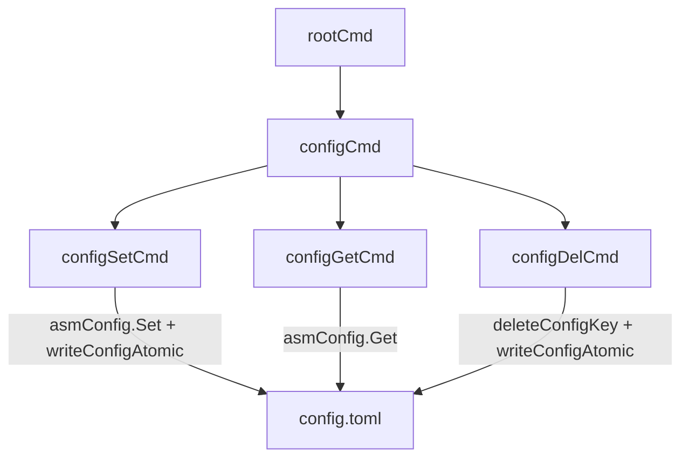

# Design Document: config-commands

## Overview

This design adds three subcommands — `config set`, `config get`, and `config del` — grouped under a `config` parent command. These commands provide a programmatic interface for managing individual keys in the TOML configuration file (`~/.config/aws-sso-manager/config.toml`) without hand-editing.

The implementation follows the existing project conventions: all code lives in `cmd/`, commands use `RunE`, errors use `fmt.Errorf` with `%w`, and file mutations use atomic write-to-temp-then-rename. The existing `asmConfig` Viper instance handles `set` and `get` operations natively. Deletion requires direct TOML manipulation because Viper has no `Delete` method — we use `pelletier/go-toml/v2` (already a transitive dependency) to parse, remove the key, and write back atomically.

### Key Design Decisions

1. **Viper for set/get, go-toml for delete**: Viper's `Set` + `WriteConfigAs` handles `config set` cleanly. For `config del`, Viper cannot remove keys, so we parse the TOML file directly with `pelletier/go-toml/v2`, delete the key from the tree, and marshal back. This avoids patching Viper internals.

2. **No locking for config.toml**: The existing advisory lock (`acquireAWSConfigLock`) protects `~/.aws/config`, not the app's own TOML config. Since `config set`/`del` mutate `config.toml` (not `~/.aws/config`), and concurrent CLI invocations editing the same TOML file is unlikely, we rely on atomic rename for crash safety without adding a second lock. If concurrent access becomes a concern later, a lock can be added.

3. **Atomic writes via same-directory temp file**: Consistent with `init.go` and `update.go`, we write to a temp file in the same directory as `config.toml`, then `os.Rename` over the target. This ensures the rename is a same-filesystem atomic operation.

4. **Flat key space with dot notation**: Keys use Viper's dot-delimited path notation (e.g., `abc.rename.prefix`). This maps directly to TOML's nested table structure. No special key validation beyond what Viper/TOML already enforce.

5. **Rolling backups before mutations**: Before any write to `config.toml`, the current file is copied to `config-<ISO-8601>.toml.bak` in the same directory. Only the 5 most recent backups are kept; older ones are pruned. Backup failures are logged as warnings but do not block the mutation — data safety is already provided by atomic writes.

## Architecture

All new code lives in a single file: `cmd/config.go`. This file defines:

* `configCmd` — the parent `config` command (no `RunE`, just groups subcommands)
* `configSetCmd` — `config set <key> <value>`
* `configGetCmd` — `config get <key>`
* `configDelCmd` — `config del <key>`
* `writeConfigAtomic` — shared helper for atomic TOML file writes
* `backupConfigFile` — creates a timestamped `.bak` copy and prunes old backups
* `deleteConfigKey` — TOML-level key deletion using `pelletier/go-toml/v2`



### Data Flow

**`config set <key> <value>`**:

1. Validate exactly 2 positional args
2. `asmConfig.Set(key, value)` — updates in-memory Viper state
3. `backupConfigFile(configPath)` — create timestamped backup, prune old backups
4. `writeConfigAtomic(asmConfig.ConfigFileUsed())` — writes Viper state to temp file, renames over target
5. Print confirmation to stdout

**`config get <key>`**:

1. Validate exactly 1 positional arg
2. `asmConfig.Get(key)` — reads from merged config (file + env + flags)
3. If nil, return error "key not set"
4. Print value to stdout with trailing newline

**`config del <key>`**:

1. Validate exactly 1 positional arg
2. Check `asmConfig.Get(key)` — if nil, return error "key not set"
3. If `--force` is not set, prompt the user for confirmation via `huh.NewConfirm()` — if declined, print cancellation message and return nil
4. `backupConfigFile(configPath)` — create timestamped backup, prune old backups
5. `deleteConfigKey(configFilePath, key)` — parse TOML, remove key, write back atomically
6. Print confirmation to stdout

## Components and Interfaces

### configCmd (parent)

```go
var configCmd = &cobra.Command{
    Use:   "config",
    Short: "Manage configuration values.",
    Long:  "Read, write, and delete individual keys in the configuration file.",
}
```

Registered in `init()` via `rootCmd.AddCommand(configCmd)`. No `RunE` — invoking `config` alone prints help automatically (Cobra default behavior).

### configSetCmd

```go
var configSetCmd = &cobra.Command{
    Use:   "set <key> <value>",
    Short: "Set a configuration value.",
    Args:  cobra.ExactArgs(2),
    RunE:  func(cmd *cobra.Command, args []string) error { ... },
}
```

* Uses `cobra.ExactArgs(2)` for argument validation — Cobra generates the descriptive error automatically.
* Calls `asmConfig.Set(args[0], args[1])`.
* Ensures parent directory exists with `os.MkdirAll(filepath.Dir(configPath), 0o0755)`.
* Calls `writeConfigAtomic(configPath)` to persist.
* Prints: `Set "%s" to "%s"\n`.

### configGetCmd

```go
var configGetCmd = &cobra.Command{
    Use:   "get <key>",
    Short: "Get a configuration value.",
    Args:  cobra.ExactArgs(1),
    RunE:  func(cmd *cobra.Command, args []string) error { ... },
}
```

* Uses `cobra.ExactArgs(1)`.
* Reads `asmConfig.Get(args[0])`.
* Returns `fmt.Errorf("key %q is not set", key)` when the value is nil.
* Prints the value via `fmt.Fprintln(cmd.OutOrStdout(), value)`.

### configDelCmd

```go
var (
    fForce bool

    configDelCmd = &cobra.Command{
        Use:   "del <key>",
        Short: "Delete a configuration value.",
        Args:  cobra.ExactArgs(1),
        RunE:  func(cmd *cobra.Command, args []string) error { ... },
    }
)
```

* Uses `cobra.ExactArgs(1)`.
* Checks existence via `asmConfig.Get(key)` — returns error if nil.
* **Confirmation prompt**: When `--force` is not set, displays the current value and asks the user to confirm deletion via `huh.NewConfirm()`. If the user declines, prints `"Deletion canceled.\n"` and returns nil (no error).
* When `--force` is set, skips the confirmation prompt entirely.
* Calls `deleteConfigKey(configPath, key)` to remove from the persisted TOML.
* Prints: `Deleted "%s"\n`.
* The `--force` flag is registered in `init()` via `configDelCmd.Flags().BoolVarP(&fForce, "force", "f", false, "skip confirmation prompt")`.

### writeConfigAtomic(configPath string) error

Shared helper that writes the current Viper state to a temp file in the same directory as `configPath`, then renames it over the target.

```go
func writeConfigAtomic(configPath string) error {
    dir := filepath.Dir(configPath)
    if err := os.MkdirAll(dir, 0o0755); err != nil {
        return fmt.Errorf("could not create config directory: %w", err)
    }

    tmp, err := os.CreateTemp(dir, ".config-*.toml")
    if err != nil {
        return fmt.Errorf("could not create temporary config file: %w", err)
    }
    tmpPath := tmp.Name()

    if err := asmConfig.WriteConfigAs(tmpPath); err != nil {
        _ = tmp.Close()
        _ = os.Remove(tmpPath)
        return fmt.Errorf("could not write config: %w", err)
    }

    if err := tmp.Close(); err != nil {
        _ = os.Remove(tmpPath)
        return fmt.Errorf("could not close temporary config file: %w", err)
    }

    if err := os.Rename(tmpPath, configPath); err != nil {
        _ = os.Remove(tmpPath)
        return fmt.Errorf("could not replace config file: %w", err)
    }

    return nil
}
```

### backupConfigFile(configPath string)

Creates a timestamped backup of the config file before mutations and prunes old backups to keep at most 5. Called by both `configSetCmd` and `configDelCmd` before writing. Backup failures are logged as warnings via `logger.Warn` but do not abort the mutation.

```go
func backupConfigFile(configPath string) {
    // Skip if the config file doesn't exist yet (first-time set).
    if _, err := os.Stat(configPath); os.IsNotExist(err) {
        return
    }

    dir := filepath.Dir(configPath)
    timestamp := time.Now().UTC().Format("20060102T150405Z")
    backupPath := filepath.Join(dir, fmt.Sprintf("config-%s.toml.bak", timestamp))

    data, err := os.ReadFile(configPath)
    if err != nil {
        logger.Warn("could not read config for backup", "err", err)
        return
    }

    if err := os.WriteFile(backupPath, data, 0o0644); err != nil {
        logger.Warn("could not write config backup", "err", err)
        return
    }

    pruneConfigBackups(dir, 5)
}
```

### pruneConfigBackups(dir string, keep int)

Lists all `config-*.toml.bak` files in the directory, sorts them by name (which sorts chronologically due to the ISO-8601 timestamp format), and removes the oldest entries that exceed the `keep` limit.

```go
func pruneConfigBackups(dir string, keep int) {
    matches, err := filepath.Glob(filepath.Join(dir, "config-*.toml.bak"))
    if err != nil {
        logger.Warn("could not list config backups", "err", err)
        return
    }

    sort.Strings(matches)

    if len(matches) <= keep {
        return
    }

    for _, old := range matches[:len(matches)-keep] {
        if err := os.Remove(old); err != nil {
            logger.Warn("could not remove old config backup", "file", old, "err", err)
        }
    }
}
```

### deleteConfigKey(configPath, key string) error

Handles TOML-level key deletion since Viper has no `Delete` method.

```go
func deleteConfigKey(configPath, key string) error {
    data, err := os.ReadFile(configPath)
    if err != nil {
        return fmt.Errorf("could not read config file: %w", err)
    }

    var tree map[string]any
    if err := toml.Unmarshal(data, &tree); err != nil {
        return fmt.Errorf("could not parse config file: %w", err)
    }

    if !deleteNestedKey(tree, strings.Split(key, ".")) {
        return fmt.Errorf("key %q not found in config file", key)
    }

    out, err := toml.Marshal(tree)
    if err != nil {
        return fmt.Errorf("could not marshal config: %w", err)
    }

    // Write atomically
    dir := filepath.Dir(configPath)
    tmp, err := os.CreateTemp(dir, ".config-*.toml")
    // ... same atomic pattern as writeConfigAtomic ...
}
```

### deleteNestedKey(tree map[string]any, parts []string) bool

Recursive helper that walks the dot-delimited key path and deletes the leaf. Returns `false` if the key path doesn't exist. Prunes empty parent tables after deletion.

## Data Models

### Config Key Format

Keys are dot-delimited strings that map to TOML's nested table structure:

| Key Example                    | TOML Equivalent                                |
|--------------------------------|------------------------------------------------|
| `profile-name`                 | `profile-name = "value"`                       |
| `abc.rename.prefix`            | `[abc.rename]` → `prefix = "value"`            |
| `abc.rename.pattern.delimiter` | `[abc.rename.pattern]` → `delimiter = "value"` |

### Config Value Format

All values passed via `config set` are stored as strings. Viper handles type coercion when values are read by other commands. This is consistent with how CLI arguments work — the user passes a string, and the consuming code interprets it.

### TOML Tree (for deletion)

The `deleteConfigKey` function works with `map[string]any` — the standard representation produced by `pelletier/go-toml/v2`'s `Unmarshal`. Nested tables become nested `map[string]any` values. The `deleteNestedKey` helper walks this tree using the dot-split key parts.

## Correctness Properties

_A property is a characteristic or behavior that should hold true across all valid executions of a system — essentially, a formal statement about what the system should do. Properties serve as the bridge between human-readable specifications and machine-verifiable correctness guarantees._

### Property 1: Set-then-get round trip

_For any_ valid config key (matching `[a-z][a-z0-9.-]{0,30}`) and any non-empty string value, calling `config set <key> <value>` followed by `config get <key>` shall return the exact same value that was set.

**Validates: Requirements 2.2, 2.3, 3.2, 6.1**

### Property 2: Set-then-delete-then-get round trip

_For any_ valid config key and any non-empty string value, calling `config set <key> <value>`, then `config del --force <key>`, then `config get <key>` shall return an error indicating the key is not set.

**Validates: Requirements 4.4, 4.5, 6.2**

### Property 3: Wrong argument count returns error

_For any_ config subcommand (`set`, `get`, `del`) and any argument count that does not match the expected arity (2 for `set`, 1 for `get`, 1 for `del`), the command shall return an error.

**Validates: Requirements 2.4, 3.4, 4.4**

### Property 4: Nonexistent key returns error

_For any_ config key that has not been set, calling `config get <key>` or `config del --force <key>` shall return an error indicating the key is not set.

**Validates: Requirements 3.3, 4.6**

### Property 5: Set confirmation output contains key and value

_For any_ valid config key and any non-empty string value, the stdout output of a successful `config set <key> <value>` shall contain both the key and the value.

**Validates: Requirements 2.6**

### Property 6: Del confirmation output contains key

_For any_ valid config key that exists, the stdout output of a successful `config del --force <key>` shall contain the key.

**Validates: Requirements 4.8**

### Property 7: Backup retention limit

_For any_ sequence of N mutations (set or delete) where N > 5, the number of `config-*.toml.bak` files in the config directory shall never exceed 5. The retained backups shall be the 5 most recent by timestamp.

**Validates: Requirements 8.4**

### Property 8: Backup content matches pre-mutation state

_For any_ config mutation (set or delete), the backup file created immediately before the mutation shall contain the exact same bytes as the config file had before the mutation.

**Validates: Requirements 8.1, 8.2**

## Error Handling

| Scenario                            | Error Message                                          | Source               |
|-------------------------------------|--------------------------------------------------------|----------------------|
| `config set` with wrong arg count   | Cobra auto-generated: `"accepts 2 arg(s), received N"` | `cobra.ExactArgs(2)` |
| `config get` with wrong arg count   | Cobra auto-generated: `"accepts 1 arg(s), received N"` | `cobra.ExactArgs(1)` |
| `config del` with wrong arg count   | Cobra auto-generated: `"accepts 1 arg(s), received N"` | `cobra.ExactArgs(1)` |
| `config get` on nonexistent key     | `"key %q is not set"`                                  | `configGetCmd.RunE`  |
| `config del` on nonexistent key     | `"key %q is not set"`                                  | `configDelCmd.RunE`  |
| `config del` declined by user       | (no error — prints `"Deletion canceled."`)             | `configDelCmd.RunE`  |
| Config directory creation fails     | `"could not create config directory: %w"`              | `writeConfigAtomic`  |
| Temp file creation fails            | `"could not create temporary config file: %w"`         | `writeConfigAtomic`  |
| Viper write fails                   | `"could not write config: %w"`                         | `writeConfigAtomic`  |
| Atomic rename fails                 | `"could not replace config file: %w"`                  | `writeConfigAtomic`  |
| TOML parse fails during delete      | `"could not parse config file: %w"`                    | `deleteConfigKey`    |
| Key not found in TOML during delete | `"key %q not found in config file"`                    | `deleteConfigKey`    |
| TOML marshal fails during delete    | `"could not marshal config: %w"`                       | `deleteConfigKey`    |
| Backup read fails                   | (warning logged, mutation proceeds)                    | `backupConfigFile`   |
| Backup write fails                  | (warning logged, mutation proceeds)                    | `backupConfigFile`   |
| Backup prune fails                  | (warning logged per file, mutation proceeds)           | `pruneConfigBackups` |

All errors are returned via `RunE` and propagated through Cobra's error handling. No `panic` or `os.Exit` in command logic. Temp files are cleaned up on error paths via `os.Remove`.

## Testing Strategy

### Unit Tests

Unit tests cover specific examples, edge cases, and structural checks:

* **Command registration**: Verify `configCmd` is registered under `rootCmd` with subcommands `set`, `get`, `del`.
* **Help output**: Verify `config` with no subcommand produces help listing `set`, `get`, `del`.
* **Directory creation**: Verify `config set` creates the parent directory when it doesn't exist (edge case from 2.5).
* **Atomic write failure**: Verify that when the temp file write fails (e.g., read-only directory), the original config file is unchanged (edge case from 5.3).
* **RunE usage**: Verify all three subcommands use `RunE` (structural check for 7.1–7.3).
* **Del confirmation prompt**: Verify `config del` without `--force` prompts for confirmation (mock `huh.NewConfirm`).
* **Del with --force**: Verify `config del --force` skips the prompt and deletes immediately.
* **Del canceled**: Verify declining the prompt prints cancellation message and leaves the config unchanged.
* **Backup creation**: Verify `config set` creates a `config-<timestamp>.toml.bak` file before writing.
* **Backup pruning**: Verify that after 7 mutations, only 5 `.bak` files remain (the 5 most recent).
* **Backup skipped on first set**: Verify no backup is created when the config file doesn't exist yet.
* **Backup failure non-fatal**: Verify that when the backup directory is read-only, the mutation still succeeds (backup failure logged as warning).

### Property-Based Tests

Property-based tests use `pgregory.net/rapid` with a minimum of 100 iterations per property. Each test references its design document property.

Tests operate against a fresh Viper instance and a temp directory for the config file, following the existing pattern in `configutils_test.go` (save `asmConfig`, replace with fresh instance, restore via `defer`).

| Test Function                          | Design Property | Tag                                                                                  |
|----------------------------------------|-----------------|--------------------------------------------------------------------------------------|
| `TestPropertyConfigSetGetRoundTrip`    | Property 1      | Feature: config-commands, Property 1: Set-then-get round trip                        |
| `TestPropertyConfigSetDelGetRoundTrip` | Property 2      | Feature: config-commands, Property 2: Set-then-delete-then-get round trip            |
| `TestPropertyConfigWrongArgCount`      | Property 3      | Feature: config-commands, Property 3: Wrong argument count returns error             |
| `TestPropertyConfigNonexistentKey`     | Property 4      | Feature: config-commands, Property 4: Nonexistent key returns error                  |
| `TestPropertyConfigSetConfirmation`    | Property 5      | Feature: config-commands, Property 5: Set confirmation output contains key and value |
| `TestPropertyConfigDelConfirmation`    | Property 6      | Feature: config-commands, Property 6: Del confirmation output contains key           |
| `TestPropertyConfigBackupRetention`    | Property 7      | Feature: config-commands, Property 7: Backup retention limit                         |
| `TestPropertyConfigBackupContent`      | Property 8      | Feature: config-commands, Property 8: Backup content matches pre-mutation state      |

### Generator Strategy

Generators for property tests:

* **Config keys**: `rapid.StringMatching("[a-z][a-z0-9]{1,8}(\\.[a-z][a-z0-9]{1,8}){0,3}")` — produces realistic dot-delimited keys like `abc`, `abc.rename`, `abc.rename.prefix`.
* **Config values**: `rapid.StringMatching("[A-Za-z0-9 _-]{1,30}")` — produces non-empty string values with common characters.
* **Arg counts (wrong)**: For `set`: `rapid.IntRange(0, 5)` filtered to exclude 2. For `get`/`del`: `rapid.IntRange(0, 5)` filtered to exclude 1.
