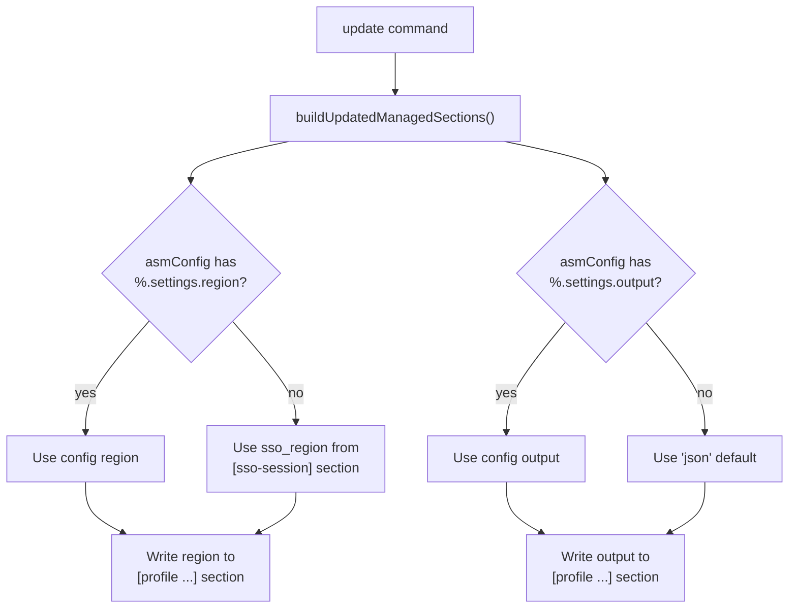

# Design Document: Config Output & Region Overrides

## Overview

This feature makes the `region` and `output` values in generated `[profile ...]` blocks configurable per SSO profile, replacing the current hardcoded defaults (`sso_region` for region, `"json"` for output). The overrides are read from the existing `%.settings.region` and `%.settings.output` keys in the TOML config file via the `asmConfig` Viper instance.

The change is surgically scoped to `buildUpdatedManagedSections` in `cmd/update.go`. The schema types (`SettingsConfig`, `SSOProfileConfig`) and config key validation (`validateConfigKey`) already support these keys — no schema changes are needed.

### Design rationale

The simplest correct approach: read the Viper config at profile-generation time and fall back to the existing defaults when no override is set. This keeps the change to a single function and preserves full backward compatibility.

## Architecture



The override resolution happens once per `buildUpdatedManagedSections` call (not per profile), ensuring all profiles in a managed section share the same resolved values. This matches Requirement 4.

### Change surface

| File                  | Change |
| --------------------- | ------ |
| `cmd/update.go`       | `buildUpdatedManagedSections`: read `asmConfig.GetString(profileName + ".settings.region")` and `asmConfig.GetString(profileName + ".settings.output")` before the profile loop; use resolved values in the `m[...]` assignments |
| `docs/config_file.md` | Add `%.settings.region` and `%.settings.output` to the TOML key tree diagram, add description sections for both keys, and add a `[%.settings]` table to the sample config |

No changes to: `cmd/configschema.go` (structs already define the fields), `cmd/configutils.go`, `cmd/config.go` (validation already works via reflection).

## Components and interfaces

### Modified function

**`buildUpdatedManagedSections`** (`cmd/update.go`)

Current signature (unchanged):

```go
func buildUpdatedManagedSections(
    sections configFile.Sections,
    ssoProfile, profileName string,
    accounts listAccounts,
) (configFile.Sections, int, error)
```

Current behavior for region/output:

```go
m["region"] = ssoSection.String("sso_region")
m["output"] = "json"
```

New behavior (pseudocode):

```go
// Resolve once, before the loop
resolvedRegion := asmConfig.GetString(profileName + ".settings.region")
if resolvedRegion == "" {
    resolvedRegion = ssoSection.String("sso_region")
}

resolvedOutput := asmConfig.GetString(profileName + ".settings.output")
if resolvedOutput == "" {
    resolvedOutput = "json"
}

// Inside the loop
m["region"] = resolvedRegion
m["output"] = resolvedOutput
```

### Existing components (No changes)

| Component                                  | Why No Change |
| ------------------------------------------ | ------------- |
| `SettingsConfig` struct                    | Already has `Region` and `Output` fields with correct JSON/TOML tags |
| `SSOProfileConfig` struct                  | Already embeds `Settings SettingsConfig` |
| `validateConfigKey()`                      | Already walks `SSOProfileConfig` via reflection — `%.settings.region` and `%.settings.output` validate correctly |
| `config set` / `config get` / `config del` | Already work with any valid schema key |

### Documentation changes (`docs/config_file.md`)

Requirement 6 adds user-facing documentation for the new settings keys. Three areas of `docs/config_file.md` need updates:

**1. TOML key tree diagram** — Add a `settings.` subtree as a sibling of `rename.` under the `%.` node:

```text
└── %.
    ├── settings.
    │   ├── region (string)
    │   └── output (enum)
    └── rename.
        └── ...
```

**2. Key description sections** — Add two new sections after the existing `profile-name` section (and before the `%.rename.*` sections):

* `%.settings.region` — Describes the key as a per-SSO-profile override for the `region` field in generated `[profile ...]` blocks. Documents the fallback behavior: when the value is empty or absent, the `sso_region` from the `[sso-session ...]` section is used instead.
* `%.settings.output` — Describes the key as a per-SSO-profile override for the `output` field in generated `[profile ...]` blocks. Documents the fallback behavior: when the value is empty or absent, `json` is used as the default. Lists the valid enum values: `json`, `text`, `table`, `yaml`, `yaml-stream`.

**3. Sample config** — Add a `[%.settings]` table before the existing `[%.rename]` table in the sample TOML block:

```toml
[abc.settings]
region = "us-west-2"
output = "json"
```

These are purely documentation changes — no code, no tests. Requirement 6 acceptance criteria (6.1–6.5) are all documentation-only and are not suitable for property-based testing or automated unit tests.

## Data models

No new data models. The existing `SettingsConfig` struct in `cmd/configschema.go` already models the relevant config:

```go
type SettingsConfig struct {
    Region string `json:"region,omitempty" toml:"region,omitempty" ...`
    Output string `json:"output,omitempty" toml:"output,omitempty" ...`
}
```

TOML config example with overrides:

```toml
profile-name = "nwl"

[nwl.settings]
region = "eu-west-1"
output = "yaml"

[nwl.rename]
# ... existing rename config ...
```

## Correctness properties

_A property is a characteristic or behavior that should hold true across all valid executions of a system — essentially, a formal statement about what the system should do. Properties serve as the bridge between human-readable specifications and machine-verifiable correctness guarantees._

### Property 1: region resolution respects config override with sso_region fallback

_For any_ SSO profile name, any `sso_region` value in the `[sso-session]` section, any (possibly empty or absent) `settings.region` config value, and any non-empty set of accounts/roles: calling `buildUpdatedManagedSections` SHALL produce profile sections where every profile's `region` field equals `settings.region` when it is non-empty, and equals `sso_region` otherwise.

**Validates: Requirements 1.1, 1.2, 1.3, 4.1.**

### Property 2: output resolution respects config override with "JSON" fallback

_For any_ SSO profile name, any (possibly empty or absent) `settings.output` config value, and any non-empty set of accounts/roles: calling `buildUpdatedManagedSections` SHALL produce profile sections where every profile's `output` field equals `settings.output` when it is non-empty, and equals `"json"` otherwise.

**Validates: Requirements 2.1, 2.2, 2.3, 4.2.**

### Property 3: settings key validation accepts region/output and rejects unknown keys

_For any_ profile name: `validateConfigKey("<profile>.settings.region")` and `validateConfigKey("<profile>.settings.output")` SHALL return no error, while `validateConfigKey("<profile>.settings.<unknown>")` (where `<unknown>` is neither `"region"` nor `"output"`) SHALL return a non-nil error.

**Validates: Requirements 3.1, 3.2, 3.3.**

### Property 4: update idempotence with settings overrides

_For any_ valid config state (with or without settings overrides) and any set of accounts/roles: calling `buildUpdatedManagedSections` twice with identical inputs SHALL produce identical output sections.

**Validates: Requirements 5.1.**

## Error handling

This feature introduces no new error paths. The existing error handling in `buildUpdatedManagedSections` (INI value creation failures, section update failures) remains unchanged.

| Scenario                                                | Behavior |
| ------------------------------------------------------- | -------- |
| `settings.region` is empty or absent                    | Falls back to `sso_region` (existing behavior) |
| `settings.output` is empty or absent                    | Falls back to `"json"` (existing behavior) |
| `settings.region` contains an invalid AWS region string | Passed through as-is — AWS CLI will report the error at runtime, not our concern |
| `settings.output` contains an invalid format            | Passed through as-is — AWS CLI will report the error at runtime |
| `config set` with unknown settings key                  | Rejected by `validateConfigKey` with descriptive error (existing behavior) |

No new `error` returns, no new `fmt.Errorf` calls. The Viper `GetString` call returns `""` for missing keys, which triggers the fallback path naturally.

## Testing strategy

### Property-Based tests (pgregory.net/rapid)

Four property tests, each running rapid's default 100+ iterations:

| Property                   | Test Function                                | What It Exercises |
| -------------------------- | -------------------------------------------- | ----------------- |
| 1: Region resolution       | `TestPropertyRegionOverrideResolution`       | `buildUpdatedManagedSections` with/without `settings.region` |
| 2: Output resolution       | `TestPropertyOutputOverrideResolution`       | `buildUpdatedManagedSections` with/without `settings.output` |
| 3: Settings key validation | `TestPropertySettingsKeyValidation`          | `validateConfigKey` for `%.settings.*` paths |
| 4: Update idempotence      | `TestPropertyUpdateIdempotenceWithOverrides` | Double-call to `buildUpdatedManagedSections` |

Each test tagged with: `// Feature: config-output-region-overrides, Property N: <title>`

**Test seam**: Properties 1, 2, and 4 need to set `asmConfig` to a fresh Viper instance with controlled settings values. Use the standard save/restore pattern from `testing-conventions.md`.

**Generators**: Reuse existing `genListAccounts(1, 5)` and `genAccountID()` from `testhelpers_test.go`. Generate settings values with `rapid.SampledFrom` for realistic AWS regions and output formats, plus `rapid.StringMatching` for arbitrary strings.

### Unit tests

Minimal additional unit tests for edge cases not covered by property tests:

* Verify existing `TestBuildUpdatedManagedSectionsUpdatesRoleFields` still passes (regression)
* Verify `TestValidateConfigKey` already covers `settings.region` and `settings.output` paths (add cases if missing)

### What's NOT tested

* AWS CLI behavior with invalid region/output values (out of scope — that's AWS CLI's responsibility)
* End-to-end `update` command execution (already covered by existing integration test `TestUpdateManagedBlockRewriteIntegration`)
