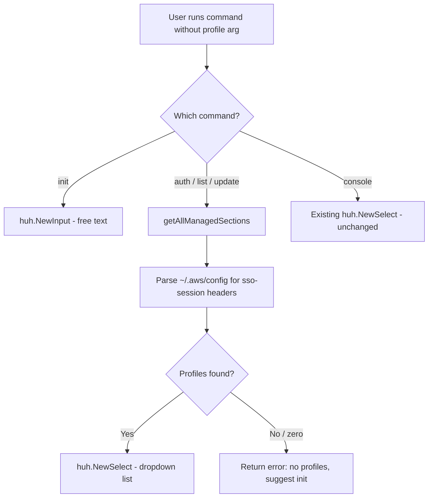

# Design Document: SSO Profile Select

## Overview

This feature replaces the free-text `huh.NewInput()` prompt for SSO profile name collection with a `huh.NewSelect()` dropdown populated from `[sso-session ...]` sections in `~/.aws/config`. The change applies to the `auth`, `list`, and `update` commands. The `init` command retains `huh.NewInput()` because it creates new profiles that don't yet exist. The `console` command already uses `huh.NewSelect()` via `getAllManagedSections()` and serves as the reference implementation.

The core logic already exists: `getAllManagedSections()` in `configutils.go` parses `[sso-session <name>]` headers, returns sorted profile names, and is already used by `console.go`. This feature reuses that function in three additional commands.

## Architecture

The change is localized to the command layer. No new packages, interfaces, or architectural changes are needed.



### Design rationale

* Reuse `getAllManagedSections()` rather than introducing a new parser. This function is battle-tested in `console.go` and already returns sorted, deduplicated profile names.
* Extract the select prompt into a shared helper function (`promptProfileSelect`) to avoid duplicating the `huh.NewSelect` setup across three commands.
* Keep `init` on `huh.NewInput()` because the profile being created doesn't exist in the config file yet.

## Components and interfaces

### New: `promptProfileSelect` helper function

A package-level function in `cmd/` that encapsulates the select prompt pattern currently inline in `console.go`:

```go
// promptProfileSelect displays a huh.NewSelect widget populated with SSO
// profile names parsed from the AWS config file. It returns the selected
// profile name or an error if no profiles are available or the user cancels.
func promptProfileSelect(target *string) error
```

Internally it:

1. Calls `getAllManagedSections()` to get sorted profile names
2. Returns a descriptive error if the slice is empty (requirement 3.3)
3. Builds and runs a `huh.NewSelect[string]` with `minMaxRows` height clamping

### Modified commands

| Command   | Current prompt           | New prompt                    |
|-----------|--------------------------|-------------------------------|
| `auth`    | `huh.NewInput()`         | `promptProfileSelect()`       |
| `list`    | `huh.NewInput()`         | `promptProfileSelect()`       |
| `update`  | `huh.NewInput()`         | `promptProfileSelect()`       |
| `init`    | `huh.NewInput()`         | No change                     |
| `console` | inline `huh.NewSelect()` | Refactor to use shared helper |

### Existing: `getAllManagedSections()` (unchanged)

```go
func getAllManagedSections() ([]string, error)
```

Already parses `[sso-session <name>]` headers from `awsConfigFilePath`, returns sorted `[]string`. No modifications needed.

### Existing: `minMaxRows()` (unchanged)

```go
func minMaxRows[T any](rows []T) int
```

Clamps TUI select height between 5 and 10. Already used by `console.go`.

## Data models

No new data models are introduced. The feature operates on:

* `[]string` — profile names returned by `getAllManagedSections()`
* `string` — the selected profile name written to the `profileName` variable in each command's `RunE`

The AWS config file format (`[sso-session <name>]` INI headers) is the data source and is already parsed by existing code.

## Correctness properties

_A property is a characteristic or behavior that should hold true across all valid executions of a system — essentially, a formal statement about what the system should do. Properties serve as the bridge between human-readable specifications and machine-verifiable correctness guarantees._

### Property 1: SSO session parsing extracts correct sorted profile names

_For any_ valid AWS config file containing N `[sso-session <name>]` sections with distinct profile names, `getAllManagedSections()` SHALL return exactly those N names in sorted alphabetical order, with no duplicates and no omissions.

**Validates: Requirements 3.1, 3.2.**

## Error handling

| Scenario                                                   | Behavior                                                                                                                         |
|------------------------------------------------------------|----------------------------------------------------------------------------------------------------------------------------------|
| AWS config file does not exist or is unreadable            | `getAllManagedSections()` returns the underlying `os.Open` error. The calling command surfaces this to the user via `RunE`.      |
| AWS config file contains zero `[sso-session ...]` sections | `promptProfileSelect()` returns a descriptive error: no SSO profiles found, suggests running `aws-sso-manager init`.             |
| User cancels the select prompt (Ctrl+C / Esc)              | `huh.NewSelect.Run()` returns an error which propagates through `RunE` to Cobra's error handling.                                |
| `getAllManagedSections()` returns an error                 | `promptProfileSelect()` propagates the error to the caller without wrapping (the original error already has sufficient context). |

## Testing strategy

### Property-Based tests (pgregory.net/rapid)

One property test covering Property 1:

* **TestPropertySSOSessionParsing**: Generate random AWS config file content with 1–5 `[sso-session <name>]` sections (names drawn from `[a-z][a-z0-9]{2,10}`), optionally interleaved with `[profile ...]` sections and `[default]` preamble. Write to a temp file, call `getAllManagedSections()`, assert the returned slice matches the input names in sorted order. Minimum 100 iterations.
  * Tag: `Feature: sso-profile-select, Property 1: SSO session parsing extracts correct sorted profile names`

### Unit tests (example-based)

| Test                                                | Validates                                                         |
|-----------------------------------------------------|-------------------------------------------------------------------|
| `TestPromptProfileSelectReturnsErrorWhenNoProfiles` | Req 3.3 — empty config yields descriptive error mentioning `init` |
| `TestAuthCommandUsesSelectPrompt`                   | Req 1.1 — auth command triggers select widget                     |
| `TestListCommandUsesSelectPrompt`                   | Req 1.2 — list command triggers select widget                     |
| `TestUpdateCommandUsesSelectPrompt`                 | Req 1.3 — update command triggers select widget                   |
| `TestInitCommandUsesInputPrompt`                    | Req 2.1, 2.2 — init command still uses free-text input            |

### Testing approach for TUI prompts

The `promptProfileSelect` function will be implemented as a package-level function variable (consistent with the project's test seam pattern). This allows tests to verify that commands call the correct prompt function without actually rendering TUI widgets:

```go
var promptProfileSelect = func(target *string) error { ... }
```

Tests swap this seam to capture whether the select prompt was invoked, following the same save/restore pattern used for `listAWSAccountsFetcher` and `osExit`.
