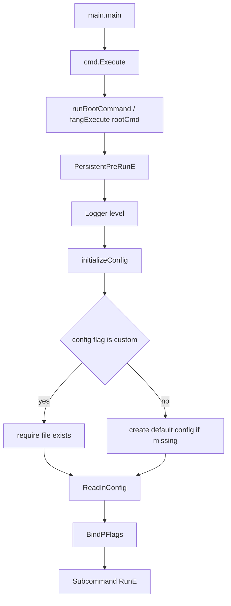

# Deep Architecture Audit

## 1. Entry Points

1. Primary binary entrypoint is [main.go](../main.go), where `main` calls `cmd.Execute`.
1. CLI runtime entrypoint is in [cmd/root.go](../cmd/root.go), where `Execute` calls `runRootCommand`, which delegates to `fangExecute` with `rootCmd`.
1. Root command lifecycle starts in `rootCmd` in [cmd/root.go](../cmd/root.go): the `PersistentPreRunE` hook initializes logging and calls `initializeConfig` before any subcommand `RunE`.
1. Command entry registrations occur during package `init` functions in [cmd/init.go](../cmd/init.go), [cmd/auth.go](../cmd/auth.go), [cmd/list.go](../cmd/list.go), [cmd/update.go](../cmd/update.go), [cmd/console.go](../cmd/console.go), [cmd/validate.go](../cmd/validate.go), and [cmd/version.go](../cmd/version.go).
1. Tooling/docs entrypoint exposure exists via `Root()` in [cmd/root.go](../cmd/root.go), returning `rootCmd` for external doc generators.

Confidence: High for concrete startup path and command registration points.

## 2. CLI Startup and Initialization Flow

### A. Startup flow from process launch to command execution

1. Process starts in `main` ([main.go](../main.go)) and immediately invokes `cmd.Execute`.
1. `Execute` calls `runRootCommand` (a test-seam variable), which calls `fangExecute` with `rootCmd` and exits non-zero on error via `osExit`.
1. Root-level `init` has already run at package load time: sets `userHomeDir`, resolves `awsConfigFilePath`, and defines persistent flags (`--config`, `--verbose`, `--json`).
1. Before any subcommand logic, `PersistentPreRunE` executes: `logger` is already a package-level var; the hook sets log level by verbosity count, then calls `initializeConfig`.

### B. Configuration bootstrap and precedence

1. `asvConfig` is a package-level Viper instance in [cmd/root.go](../cmd/root.go).
1. `initializeConfig` enables environment variable support with prefix `ASV` and an underscore replacer.
1. If the user passed a non-default config path, the file must exist or initialization fails.
1. If using the default path and the file is absent, the program creates `~/.aws-sso-manager.toml` automatically.
1. Config is read with tolerant handling for file-not-found errors.
1. Flags are bound to Viper with `BindPFlags` on the command-local flag set.

Mermaid startup diagram:

Confidence: High for order and control transfer; medium for exact Fang internals (external library).

## 3. Command-Specific Flows

### A. `init` command

1. Declared and registered in [cmd/init.go](../cmd/init.go) via its `init` function.
1. Resolves profile name from positional arg, `profile-name` config key, or interactive prompt.
1. Reads optional SSO fields (`sso_start_url`, `sso_region`) from the TOML config.
1. Acquires an exclusive file lock via `acquireAWSConfigLock` before any writes.
1. Loads AWS config sections via `loadAWSConfig`; aborts if `[sso-session <profile>]` already exists.
1. Guards against orphaned markers: if `markersExist` returns true, aborts before attempting writes.
1. Prompts interactively for any missing SSO URL or region values.
1. Writes new `sso_start_url`, `sso_region`, and `sso_registration_scopes` into the in-memory section map.
1. Appends managed block markers and section text to a temp file via `os.CreateTemp`, then atomically replaces the real AWS config using `os.Rename`.

Branch behavior:

1. Existing session section branch stops with actionable error.
1. Orphaned marker branch stops with actionable error before writing.
1. Missing inputs branch enters interactive mode.
1. Failure points use `cobra.CheckErr` in several places, causing immediate process termination.

### B. `auth` command

1. Declared and registered in [cmd/auth.go](../cmd/auth.go).
1. Resolves profile similarly to `init` (arg / config / prompt).
1. Gets SSO session profile from AWS config via `getSsoSession`; finds cache file path via `getCacheFilePath`.
1. If `cacheData.read` succeeds and the token is still valid, reports remaining validity and exits.
1. If cache read fails or is expired, triggers device authorization flow:
   builds SDK config with `getSDKConfig(requestCtx, ...)`,
   starts auth via `authenticateSSOProfile`,
   extracts user code,
   optionally opens browser,
   polls token endpoint via `waitForCustomerToAuthenticate`,
   saves result via `cacheData.save`.

Branch behavior:

1. Valid cache short-circuits login.
1. Expired/missing cache enters OIDC device flow.
1. Browser flag controls side effect: launch browser vs print URL.

### C. `list` command

1. Declared and registered in [cmd/list.go](../cmd/list.go).
1. Resolves profile (arg / config / prompt), then retrieves SSO session and AWS SDK config via `getSsoSession` and `getSDKConfig`.
1. Requires valid cache; otherwise returns not-authenticated error.
1. Uses spinner-wrapped account and role discovery via `listAWSAccounts`.
1. Output branch: JSON output mode vs styled TUI table output, controlled by `--json` flag.
1. Empty accounts list exits process with code 0.

### D. `update` command

1. Declared and registered in [cmd/update.go](../cmd/update.go).
1. Resolves profile, then acquires an exclusive file lock via `acquireAWSConfigLock`.
1. Extracts managed section to temp file via `getManagedSection`, which calls `validateManagedMarkers` first.
1. Loads temp sections via `loadAWSConfig`.
1. Retrieves SSO profile via `getSsoSession`, builds SDK config via `getSDKConfig(cmd.Context(), ...)`, finds cache path via `getCacheFilePath`, and reads cached token via `cacheData.read`.
1. Validates presence of `sso-session` section; reports using the resolved `ssoProfile` name on failure.
1. Fetches current account-role assignments from AWS SSO via `listAWSAccounts`.
1. For each role, creates or updates profile section values in the sections map.
1. Rewrites temp file via `generateAWSConfig`; injects managed block back into a backup copy of the full AWS config via `setManagedSection` (inject-once guard prevents duplication).
1. Sets permissions on backup, removes temp file, atomically renames backup to real config path via `os.Rename`, then releases the lock via `Release`.

Branch behavior:

1. If no managed markers or no session section, path fails early.
1. Existing profile sections are updated; missing sections are created.
1. Several file operations use `CheckErr`, so any I/O failure aborts the process.

### E. `console` command

1. Declared and registered in [cmd/console.go](../cmd/console.go).
1. Parses positional args polymorphically: URL vs profile when one arg is given.
1. Applies `--region` flag to `sessionProfile.Region` before calling `getSDKConfig`.
1. Builds dynamic interactive form for any missing values (URL, profile, account ID, role).
1. Requires authenticated cache and account/role listing via `listAWSAccounts`.
1. Generates final start URL by finding SSO start host via `getStartURL`, stripping the account-prefixed console host via `stripAccountFromURL`, query-escaping destination, and formatting the final link.

### F. `version` command

1. Registered in [cmd/version.go](../cmd/version.go) via its `init` function.
1. No local side effects beyond command availability.

### G. `validate` command

1. Declared and registered in [cmd/validate.go](../cmd/validate.go) with aliases `check` and `lint`.
1. Calls `inspectManagedMarkers()` to perform a single-pass whole-file scan, returning a `managedMarkerReport` containing per-profile start/end counts, issues, and the full profile list.
1. Calls `getAllManagedSections()` to collect all `[sso-session <profile>]` section names from the AWS config.
1. Builds a union of both sets to cover the full population: marker-only profiles and sso-session-only profiles.
1. For each profile in the union, reports:
   * structural issues from the marker scan (overlapping blocks, unmatched ends, duplicates, mismatches);
   * orphaned markers (marker present but no matching `sso-session` section);
   * unmanaged sections (`sso-session` section present but no markers).
1. Exits 0 when all checks pass, exits 1 when any problem is found.

## 4. File and Module Responsibilities

1. [main.go](../main.go)
   Process bootstrap only; intentionally thin entrypoint forwarding to the cmd package.
1. [cmd/root.go](../cmd/root.go)
   Core application shell: global state variables (`asvConfig`, `awsConfigFilePath`, `logger`), root command metadata, persistent flags, logger setup, config initialization via `initializeConfig`, and `Execute`/`Root` accessors. Test seams (`runRootCommand`, `fangExecute`, `fangNotifySignals`, `osExit`) allow signal and exit behavior to be exercised in tests.
1. [cmd/lockutils.go](../cmd/lockutils.go)
   Exclusive file locking for the AWS config. `acquireAWSConfigLock(ctx)` creates a lock file adjacent to the AWS config and acquires a `syscall.Flock` exclusive lock with a 5-second timeout (`awsConfigLockTimeout`) and 100 ms retry interval. `Release()` unlocks and closes the file. Used by both `init` and `update` before any write operations.
1. [cmd/awsutils.go](../cmd/awsutils.go)
   AWS and persistence utility backbone:
   cache file serialization/read/expiry validation via `cacheData.read` and `cacheData.save`,
   AWS config load/create/generation via `loadAWSConfig`, `createAWSConfigFile`, `generateAWSConfig`,
   SDK config and SSO session discovery via `getSDKConfig` and `getSsoSession`,
   OIDC device auth workflow via `authenticateSSOProfile` and `waitForCustomerToAuthenticate`,
   account and role discovery/pagination/filtering via `listAWSAccounts`.
1. [cmd/configutils.go](../cmd/configutils.go)
   Marker parsing and managed-block mutation utilities:
   whole-file structural scan via `inspectManagedMarkers` (returns `managedMarkerReport` with per-profile issues, counts, and profile list),
   profile marker check via `markersExist`,
   per-profile structural check via `validateMarkers`,
   whole-file structural check via `validateManagedMarkers`,
   managed-section extraction to temp file via `getManagedSection` (calls `validateManagedMarkers` first),
   inject-once managed-section rewrite via `setManagedSection`,
   full profile population from markers via `getAllMarkedProfiles`,
   sso-session section enumeration via `getAllManagedSections`,
   profile name synthesis from TOML rename settings via `getProfileName`.
1. [cmd/validate.go](../cmd/validate.go)
   Standalone marker integrity command. Drives `inspectManagedMarkers` and `getAllManagedSections`, unions results, and reports per-profile OK/FAIL with detail. Aliases: `check`, `lint`.
1. [cmd/init.go](../cmd/init.go)
   Initial seed workflow for creating `sso-session` block and managed markers in AWS config, with lock acquisition and atomic write via `os.CreateTemp` + `os.Rename`.
1. [cmd/auth.go](../cmd/auth.go)
   Authentication lifecycle manager: cache-validity fast path plus device authorization fallback with optional browser launch. All AWS calls use a context derived from `cmd.Context()`.
1. [cmd/list.go](../cmd/list.go)
   Read-only discovery UI: lists account-role visibility with optional filters and JSON output.
1. [cmd/update.go](../cmd/update.go)
    Reconciliation engine: syncs discovered account/role combinations into managed profile sections, with lock acquisition and atomic rename via `os.Rename`.
1. [cmd/console.go](../cmd/console.go)
    Console deep-link generator: interactive selection and URL transformation to build start portal link with target account and role. Applies `--region` flag to session profile before SDK config construction.
1. [cmd/version.go](../cmd/version.go)
    Minimal version command registration using shared helper.
1. [README.md](../README.md)
    Operational contract and expected workflow, including marker dependency for update.
1. [docs/config_file.md](config_file.md)
    Config schema contract for profile naming behavior, directly consumed by `getProfileName` in [cmd/configutils.go](../cmd/configutils.go).

## 5. Decision Points and Side Effects

### A. Major decision points

1. Config source selection: custom config path strict-exists check vs auto-create default, in `initializeConfig`.
1. Profile resolution: positional arg, then config default, then prompt across all interactive commands (init/auth/list/update/console).
1. Auth path: valid cache skip vs OIDC device login flow, branched on `cacheData.read` result in `auth` command.
1. Output mode in `list`: JSON branch vs TUI table branch, controlled by `--json` global flag.
1. Managed section update in `update`: create missing profile sections vs mutate existing, keyed by profile name in sections map.
1. Lock acquisition: `init` and `update` both call `acquireAWSConfigLock` before writes; context cancellation or timeout aborts cleanly.

### B. External integrations

1. AWS SDK v2 config loader and SSO APIs:
   `config.LoadDefaultConfig` in `getSDKConfig`,
   `ssooidc RegisterClient/StartDeviceAuthorization/CreateToken` in `authenticateSSOProfile` and `waitForCustomerToAuthenticate`,
   SSO account/role paginators in `listAWSAccounts`.
1. Terminal UI libraries: Cobra/Fang CLI, Huh forms/spinners, Lipgloss table rendering.
1. OS/browser integration: browser open side effect in `auth` command (opt-in via `--browser` flag).
1. Filesystem integration:
   cache and AWS config read/write via `loadAWSConfig`, `cacheData.read`, `cacheData.save`,
   atomic config replace via `os.CreateTemp` (init) and `os.Rename` (init, update),
   exclusive locking via `acquireAWSConfigLock` / `Release`.

### C. State transitions

1. Local state: global config/logger/path variables initialized once in root package scope.
1. Auth state: unauthenticated to authenticated via `cacheData.save` in `auth` command.
1. Config state: AWS config managed section evolves through `init` and `update` runs, keyed by marker comments; structural validity enforced by `validateManagedMarkers` before extraction.

### D. Error pivots

1. Mixed error handling model: some paths return errors; others call `cobra.CheckErr` or `logger.Fatal`, causing immediate exit.
1. OIDC polling in `waitForCustomerToAuthenticate` explicitly classifies many AWS exception types (authorization pending, slow down, expired, access denied).
1. Cache expiry triggers explicit invalidation error in `cacheData.read`.
1. `init` and `update` have hard-fail I/O pivots; all protected by lock acquisition.

Confidence: High for side effects and error pivots directly visible in code.

## 6. Risks, Gaps, and Follow-up Inspections

Items previously flagged have been resolved in the current codebase. The table below reflects current status.

| # | Risk / Gap                                                                                                   | Status                                                                                                                                                          |
|---|--------------------------------------------------------------------------------------------------------------|-----------------------------------------------------------------------------------------------------------------------------------------------------------------|
| 1 | Update rewrite left trailing stale bytes (`O_WRONLY` without truncate)                                       | **Resolved** — `update` now uses `os.Rename` for atomic replacement; no truncate needed.                                                                        |
| 2 | Incorrect error message context when `sso-session` missing in `update` (`profileHeaderName` used before set) | **Resolved** — error now uses the resolved `ssoProfile` variable.                                                                                               |
| 3 | Potential injection duplication in managed section merge                                                     | **Resolved** — `setManagedSection` uses an `injectedInBlock` guard ensuring exactly one injection per block encounter.                                          |
| 4 | `fRegion` flag unused in `console` flow                                                                      | **Resolved** — `sessionProfile.Region = fRegion` applied before `getSDKConfig` call.                                                                            |
| 5 | Global mutable variables can complicate future concurrency/tests                                             | **Partially mitigated** — test seams (`runRootCommand`, `fangExecute`, `osExit`) added; global `asvConfig`, `logger`, `awsConfigFilePath` remain package-level. |
| 6 | Marker contract only documented behaviorally; no validation enforced                                         | **Resolved** — `inspectManagedMarkers` performs whole-file structural validation; `validate` command exposes it as a user-facing tool.                          |
| 7 | No explicit safeguards around concurrent writes to AWS config                                                | **Resolved** — `acquireAWSConfigLock` in [cmd/lockutils.go](../cmd/lockutils.go) provides exclusive `syscall.Flock`-based locking with a 5-second timeout.      |
| 8 | Fang wrapper behavior and signal handling uncertain                                                          | **Resolved** — `fangNotifySignals = []os.Signal{syscall.SIGINT, syscall.SIGTERM}` is explicit; `runRootCommand` and `fangExecute` are testable seams.           |

### Residual considerations

* Command dispatch remains runtime-dynamic through cobra/fang; exact branch depends on argv and cannot be fully statically determined.
* The marker format is a contract: changing the literal comment prefix would require updating `inspectManagedMarkers` and all related parsers in `configutils.go`.
* AWS pagination and permissions shape execution and failure behavior at runtime in `listAWSAccounts`.

Assumptions and confidence levels:

1. Assumption: all commands execute `PersistentPreRunE` via Cobra/Fang composition.
   Confidence: High, but exact edge behavior with help/completion subcommands depends on external framework wiring.
1. Assumption: managed markers are unique per profile.
   Confidence: High; `inspectManagedMarkers` now explicitly detects and reports duplicate blocks.
1. Assumption: AWS shared config path from SDK helper maps to intended user file in all environments.
   Confidence: Medium; behavior likely correct but environment override handling is not explicit in this codebase.
